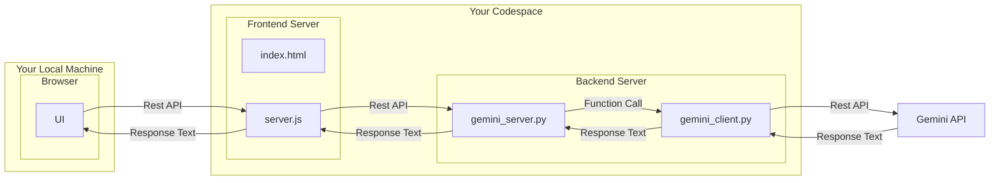

# Gemini Math Tutor
#### Last Updated: October 25, 2025


## Codespaces 

- This project is designed for contributors to use GitHub Codespaces in a browser — no local installs are required. The devcontainer provisions Python, Node, and the extensions needed for development.

- Contributors are expected to obtain a Gemini API key and add it as a Codespaces secret (secure, not checked into the repo).
	- [General introduction to Github Codespaces](https://www.youtube.com/watch?v=fI6LyWuxwcQ)
    - [How to fork a Github repo](https://www.youtube.com/watch?v=-9ftoxZ2X9g)
    - [How to start Codespaces for a repo you forked](https://www.youtube.com/watch?v=2P-LycfbDF0)
	- [How to obtain Gemini key](https://www.youtube.com/watch?v=6BRyynZkvf0)
	- [How to add a Codespaces secret](https://www.youtube.com/watch?v=Y8u2eH8aGOw)

### Recommended contributor flow
1. Create/open a Codespace for this repository (via the GitHub UI or VS Code).
2. Add a Codespaces secret named `GEMINI_API_KEY` containing your API key (see link above).
3. Rebuild the Codespace/devcontainer if prompted so post-create commands run and the extension is installed.
4. In the Codespace terminal run:

```bash
bash start_dev.sh
```

## What `start_dev.sh` does (short)
- Validates `GEMINI_API_KEY` is present in the environment.
- Runs a small key-check that exercises the Gemini client and prints a short sample output.
- Starts the FastAPI backend and waits for `/health`.
- Performs a quick end-to-end request to the running server using the bundled client.
- Attempts to start the frontend dev server (port 3000) if `npm` is available.
- Waits for the frontend to be ready and prints (or attempts to open) a preview URL appropriate for Codespaces or localhost.
- Tails backend and frontend logs and cleans up background processes when you press Ctrl-C.

Codespaces will launch the app in a browser tab (pop-up) make sure it is not blocked.

Additionally the output of the script will have something like the following, you can copy the url and paste it into your browser.
```
Application is ready. Open this URL in your browser:
  https://your-codespaces-name-3000.app.github.dev
```

## Architecture diagram

The following Mermaid diagram shows how the frontend, backend, and Gemini client interact:



### Security note
Do not commit API keys or secrets. Use Codespaces secrets for secure injection into the container. Local testing may use a session-only `export GEMINI_API_KEY=...` but avoid saving keys to files that could be committed.


